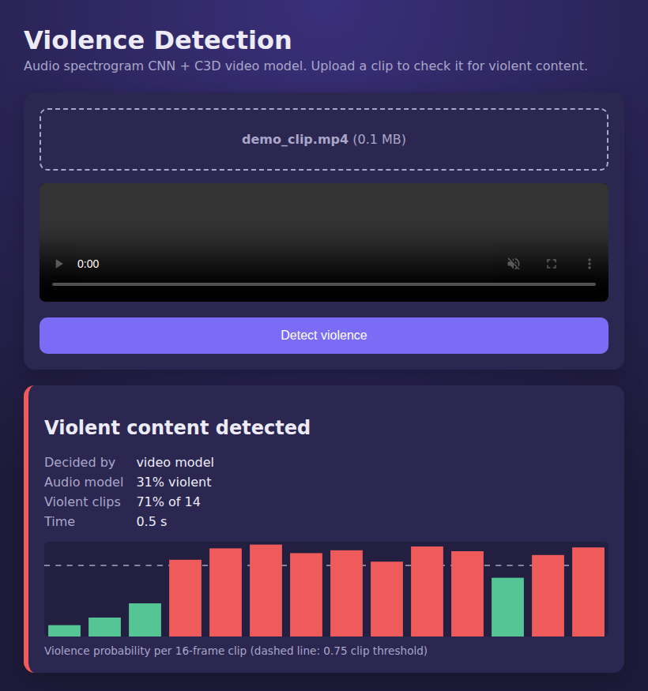

# Detection of Violent Content in Videos using Audio-Visual Features

Final-year capstone at PES University (2022). The work became the paper
**"Detection of Violent Content in Videos using Audio Visual Features"**,
which won the **2nd Best Paper Award at IEEE ICAECIS 2023** (out of 1,300+
submissions).

📄 [Paper on IEEE Xplore](https://doi.org/10.1109/ICAECIS58353.2023.10170034) ·
📘 [Final report](docs/PW22_RR_02-Final_Report.pdf) ·
🌐 [Project write-up](https://mayuravarsha.github.io/#violence-detection)

**Team:** Rishab K S, Pranav M R, Yashwal S Kanchan and Mayuravarsha P,
guided by Dr. Roopa Ravish.


<sub>Web UI. The probabilities in this screenshot are placeholder outputs from a stub model,
used because the trained weights are not in the repository.</sub>

## How it works

The system analyses a video in two stages, so the expensive 3D-CNN only
runs when the cheap audio check is not conclusive:

```
video ─► ffmpeg ─► mono WAV @ 44 kHz ─► |STFT| spectrogram (1024 × 129) ─► audio CNN
                                                                               │
                                              P(violent) > 0.8 ? ──── yes ──► VIOLENT (video model skipped)
                                                                               │ no / no audio track
                                                                               ▼
video ─► frames 112×112 ─► 16-frame clips ─► C3D (Sports-1M, frozen) ─► fc6 (4096-d)
                                               ─► Dense 1024 ─► Dense 512 ─► sigmoid, one score per clip
                                                                               │
                              clip violent if score ≥ 0.75; video violent if > 70 % of clips are
```

| Stage | Model | Parameters |
|---|---|---|
| Audio | 3 × (Conv2D → BatchNorm → MaxPool → Dropout), Dense(64), softmax(2) on the spectrogram | 3.9 M at 1024 frames |
| Video | [C3D](https://arxiv.org/abs/1412.0767) pretrained on Sports-1M as a frozen feature extractor, with a 3-layer dense head | 65.9 M total, **4.72 M trainable** |

The parameter counts are checked by tests against the numbers in the paper.

## Results (from the paper)

Stratified shuffle-split cross-validation on 16-frame chunks (70 % train,
10 % validation, 20 % test):

| Dataset | Accuracy |
| --- | --- |
| Violent Flows | 96.18 % |
| Movies | 97.58 % |
| Hockey Fights | 96.85 % |
| Real-Life Violence Situations (RLVS) | 95.50 % |
| **Average** | **96.53 %** |

Precision, recall, specificity and F1 for each dataset, plus a comparison
with earlier methods, are in chapter 7 of the
[report](docs/PW22_RR_02-Final_Report.pdf).

## Running it

The trained models (`final_video_model.h5`, and optionally
`final_audio_model.h5`) are not in the repository because of their size.
Put them in `weights/` (see [weights/README.md](weights/README.md)).

```bash
pip install -r requirements.txt           # TensorFlow 2.12–2.15; ffmpeg must be on PATH

# one video from the command line
python -m violence_detection analyze path/to/clip.mp4 --weights weights/

# HTTP API on :5000
python -m violence_detection serve

# web UI on :5173 (proxies /api to :5000)
cd frontend && npm install && npm run dev
```

### API

`POST /api/analyze` takes a multipart `file` field
(`.mp4 .avi .mov .mkv .webm .mpg`, 200 MB limit) and returns:

```json
{
  "violent": true,
  "decided_by": "video",
  "audio_probability": 0.31,
  "violent_clip_share": 0.71,
  "clips": [{"start": 0.0, "end": 0.64, "probability": 0.12}],
  "seconds": 4.8,
  "note": ""
}
```

## Tests

```bash
pip install -r requirements-dev.txt && pytest     # 28 tests (TF/ffmpeg ones skip if missing)
cd frontend && npm test                           # UI tests with Vitest
```

The tests cover:
* the cascade logic: audio short-circuit, thresholds, videos without audio
  and videos shorter than one clip
* spectrogram preprocessing, checked against `tf.signal.stft`
* the API's validation (file type, size, path traversal)
* the model definitions against the paper's parameter counts

GitHub Actions runs the backend, model and frontend jobs.

## Project layout

```
violence_detection/
  audio.py      ffmpeg extraction, resampling, NumPy STFT identical to tf.signal.stft
  video.py      frame reading and 16-frame clips
  cascade.py    two-stage decision, per-clip timeline
  models.py     Keras definitions (audio CNN, C3D, video head) + loading trained weights
  api.py        Flask app factory
frontend/       React (Vite) upload page and result view
tests/          pytest suite
docs/           final report, original backend, screenshot
weights/        trained models go here (git-ignored)
```

## What changed from the 2022 code

The original `backend.py` is kept in [`docs/original_backend.py`](docs/original_backend.py).

* **The audio stage never influenced the result.** Its prediction was
  printed and then discarded, so every video went through the video model.
  The cascade now works the way the paper describes.
* The video model was **reloaded from disk for every 16-frame clip**.
  Models now load once and clips are scored in batches.
* Short videos crashed with a division by zero, cleanup used Windows-only
  paths, uploads had no type or size checks, and the server ran in debug
  mode.
* The React frontend could not be installed. It had no `package.json` and
  imported a `LoadingButton` component that was missing. It has been
  rebuilt with Vite, with a per-clip timeline and error handling.
* **Note on the report's audio listing:** it ends in
  `Dense(1, activation='softmax')`, which always outputs 1.0, and its
  `Dropout` layers are created but never added to the model. The deployed
  server read two outputs, so `models.build_audio_model` uses a 2-way
  softmax with the dropout applied. At the report's 1,900-frame input it has
  7.33 M trainable parameters; the report quotes 7.85 M.

## Citation

```bibtex
@inproceedings{violence_av_2023,
  title     = {Detection of Violent Content in Videos using Audio Visual Features},
  booktitle = {2023 International Conference on Advances in Electronics, Communication,
               Computing and Intelligent Information Systems (ICAECIS)},
  year      = {2023},
  doi       = {10.1109/ICAECIS58353.2023.10170034}
}
```
